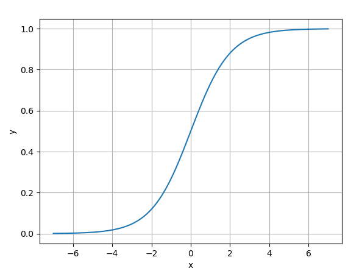
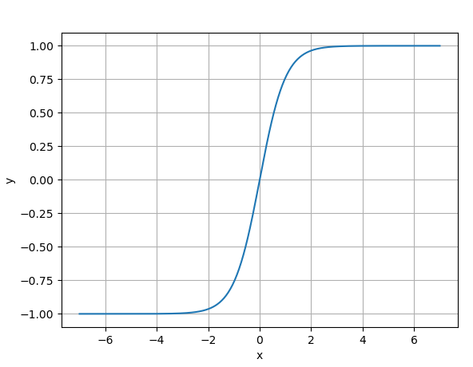
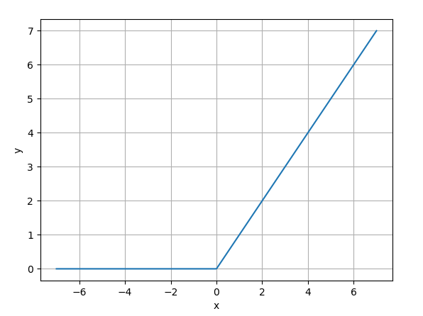
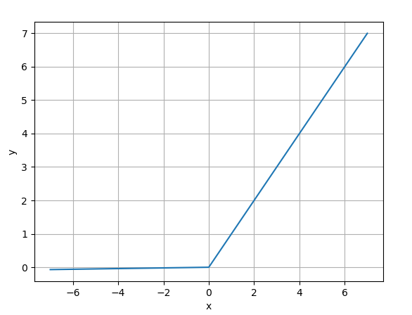
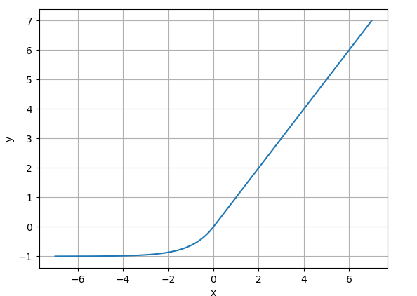
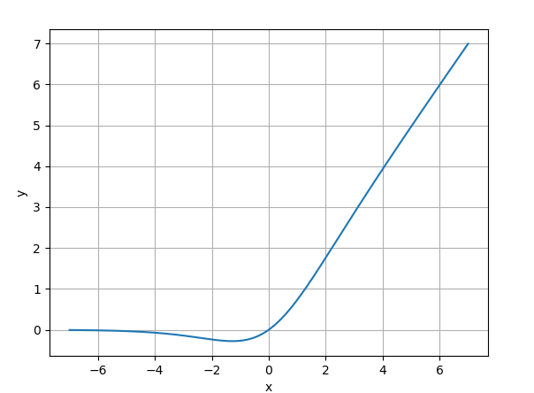
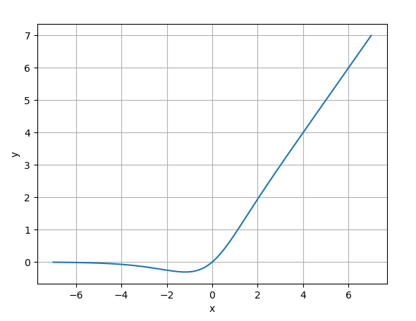

## 1. 前言
在神经网络中，激活函数（Activation Function）是决定神经元输出信号的关键组件。它通过引入非线性特性，使神经网络能够学习和模拟复杂的模式。

> 激活函数的作用:
> 
> 1. **引入非线性**：神经网络的作用便是用于拟合难以描述的函数关系，如果没有激活函数，多层神经网络等价于单层现性变换，无法解决非线性问题，即无法拟合出非线性函数关系。
>
> 2. **控制输出范围**：比如 Sigmoid 将输出压缩到 (0, 1)，适合概率输出
>
> 3. **梯度传播**：激活函数的导数影响反向传播的梯度，避免梯度消失或爆炸。

## 2. Sigmoid（Logistic 函数）
- **公式**：
$$ \sigma(x) = \frac{1}{1 + e^{-x}} $$

- **图像**：S 型曲线，输出范围为 (0, 1)。（如下所示）

- **优点**：
  - 输出可解释为概率。
  - 平滑梯度，适合**浅层**网络。（深层网络不太适用）

- **缺点**：
  - 梯度消失：当输入绝对值较大时，导数接近 0 。
  - 非零中心化：输出均值不为 0，影响梯度更新效率。

- **适用场景**：二分类输出层、早期简单神经网络

## 3. Tanh（双曲正切函数）
- **公式**：
$$ tanh(x) = \frac{e^x - e^{-x}}{e^x + e^{-x}} $$

- **图像**：S 型曲线，输出范围 (-1, 1)。（如下所示）

- **优点**：
  - 零中心化：输出均值为 0, 梯度更新更高效。
  - 比 Sigmoid 更陡峭的梯度。
- **缺点**：
  - 仍存在梯度消失问题。
- **适用场景**：隐藏层，尤其是 RNN、LSTM 等。

## 4. ReLU（Rectified Linear Unit 非线性激活单元）
- **公式**：
$$ ReLU(x) = max(0, x)$$
- **图像**：左半轴恒为 0，右半轴恒为线性。（如下所示）

- **优点**：
  - 计算高效：无指数运算。
  - 缓解梯度消失：正区间导数为 1 。
- **缺点**：
  - Dead ReLU 问题：输入为负时梯度为 0，神经元”死亡“。
  - 输出非零中心化：
- **适用场景**：大多数前馈神经网络的隐藏层（默认选择）。

> 前馈神经网络（Feedforward Neural Network, FNN）是人工神经网络中最基础、最广泛使用的类型之一，其核心是数据单向流动（从输入层到输出层），没有循环或反馈连接。

## 5. Leaky ReLU
> ReLU 的升级版
>
> 
- **公式**：
$$LeakyReLU(x) = \left\{\begin{matrix} x \text{ if x>0} \\ \alpha x \text{ otherwise} \end{matrix}\right.$$
（通常 $\alpha = 0.01$）

- **图像**：（如下所示）

- **改进**：负区间引入小斜率 $\alpha$，缓解 Dead ReLU。
- **优点**：
  - 保留 ReLU 优点，减少神经元死亡。
- **缺点**：
  - $\alpha$ 需手动设定或学习。
- **适用场景**：需解决 Dead ReLU 问题的深层网络。

## 6. Parametric ReLU（PReLU）
> Leaky ReLU 的升级版
- **公式**：类似于 Leaky ReLU，但 $\alpha$ 是可学习参数
- **优点**：自适应调整负区间斜率。
- **缺点**：增加参数量，可能过拟合。
- **适用场景**：大型网路（如 ResNet）

## 7. ELU（Exponential Linear Unit）
> ReLU 的另一个升级版

- **公式**：
$$ELU(x) = \left\{\begin{matrix} x \text{ if x>0} \\ \alpha(e^x - 1) \text{otherwise} \end{matrix}\right.$$

- **图像**：（如下所示）

（通常 $\alpha = 1$）
- **优点**：
  - 负区间平滑过渡，接近零均值输出。
  - 缓解 Dead ReLU 问题。
- **缺点**：
  - 指数计算增加复杂度。
- **适用场景**：深层网络，对噪声敏感的任务

## 8. Softmax
- **公式**：
$$Softmax(x_i) = \frac{e^{x_i}}{\Sigma^n_{j=1} e^{x_j}}$$

- **特点**：将输出压缩为概率分布（总和为 1）。
- **适用场景**：多分类输出层。

## 9. Swish
- **公式**：
$$Swish(x) = x \cdot \sigma(\beta x) $$
($\sigma$ 为 Sigmoid，$\beta$ 常设为 1 或可学习)

- **优点**：
  - 平滑且非单调，实验显示优于 ReLU。
- **缺点**：计算量略大。
- **适用场景**：替代 ReLU 的隐藏层。

## 10. Mish
- **公式**：
$$Mish(x) = x \cdot \tanh(\ln(1+e^x))$$

- **优点**：
  - 更平滑的梯度，缓解 Dead ReLU。
- **缺点**：计算成本高。
- **适用场景**：计算机视觉任务。
