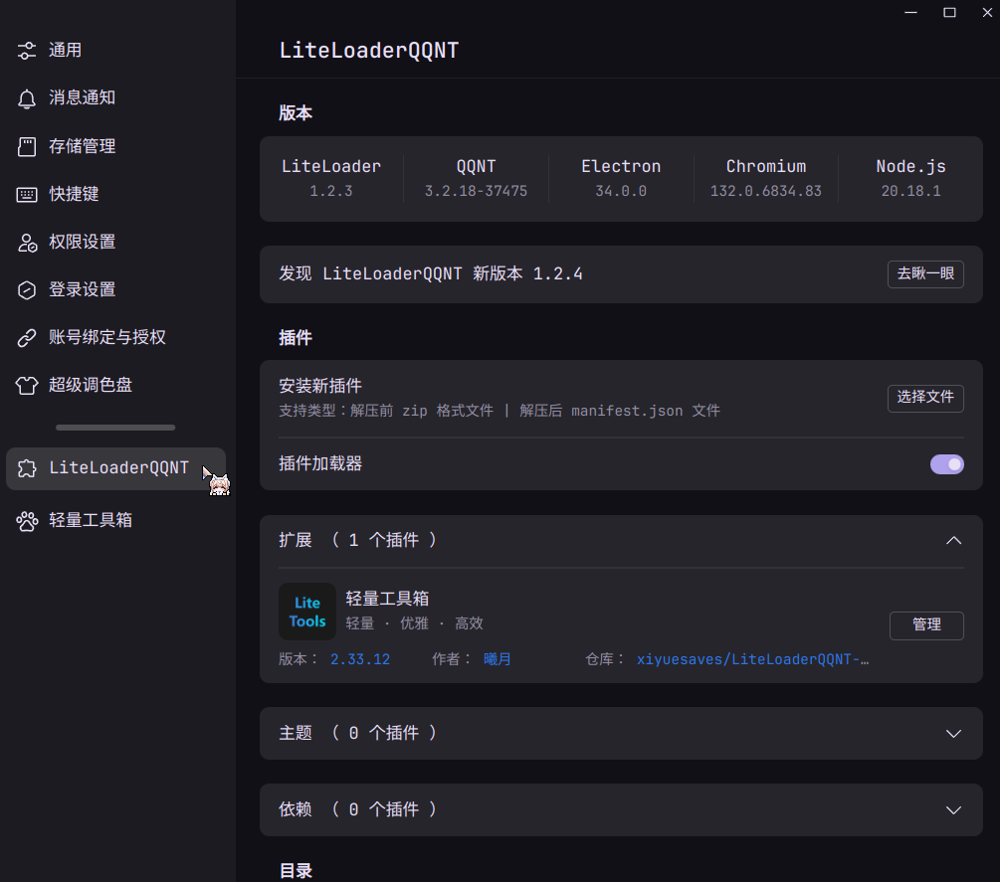

## 0. 简介
> “LiteLoaderQQNT 是 QQNT 的插件加载器，一般在 QQNT 的环境内简称为 LiteLoader
它可以让你自由地为 QQNT 添加各种插件，并实现例如美化主题、增加功能等各种功能
支持 QQNT 桌面端 全架构 最低 34xxx 版本到官网最新版本（一般情况是这样的）。”
> 
> 官方文档：[LiteLoaderQQNT](https://liteloaderqqnt.github.io/)

## 1. 安装
使用 Arch Linux 系统可以通过 AUR 安装：
- https://aur.archlinux.org/packages/liteloader-qqnt-bin
- https://aur.archlinux.org/packages/liteloader-qqnt-git

执行以下命令：
```bash
paru -S liteloader-qqnt-bin
```

等待安装完成后，进入到 `/home/USER/.config/QQ/` 目录下（ aur 官方仓库给出的建议目录是 `${XDG_CONFIG_HOME/QQ/LiteLoaderQQNT}`），创建文件夹 `LiteLoaderQQNT`，以便后续步骤中迁移数据目录。

接着进入到 `/opt/QQ/resources/app/app_launcher/` 目录下，创建文件 `LiteLoader.js`，并在其中写入如下内容（**按照你的实际路径填写**）：

```js
require(String.raw`/home/USER/.config/QQ/LiteLoaderQQNT`)
```

接着修改 `app/package.json` 文件，将 `main` 后值修改为 `./app_launcher/LiteLoader.js`。

然后，执行下面的命令将 `/opt/LiteLoaderQQNT` 目录下的所有内容迁移到 `/home/USER/.config/QQ/LiteLoaderQQMT` 目录下：

```bash
cp -r /opt/LiteLoaderQQNT/* /home/USER/.config/QQ/LiteLoaderQQNT/
```

> 上面的这步迁移，原因在于：
> - `/opt` 是系统目录，需要 sudo 权限，普通用户会遇到无法写入的问题。
> - 安装多个用户时共享 `/opt/LiteLoaderQQNT` 不安全。
> - 遵循 `XDG` 标准能够让桌面环境、应用更一致，便于清理与迁移。

然后，在 `/home/USER/.config/QQ/LiteLoaderQQMT` 目录下创建 `data`、`plugins` 两个文件夹，用于后续配置插件。

此时，当你打开 QQ，点开设置界面，将会发现你的设置界面出现了 LiteLoaderQQNT 这一栏：



## 2. 配置插件

这里以[轻量工具箱](https://github.com/xiyuesaves/lite_tools/tree/v4) 插件为例：

在官方的 Github 仓库中下载[最新发布版本](https://github.com/xiyuesaves/LiteLoaderQQNT-lite_tools/releases/latest)中的 `lite_tools.zip` 文件，接着在 `/home/USER/.config/QQ/LiteLoaderQQMT/plugins/` 目录下创建 `lite_tools` 文件夹，然后将 `lite_tools.zip` 文件中的内容解压到 `lite_tools` 文件夹下。

重启 QQNT 即可安装完成，配置界面出现了一个新的插件！
