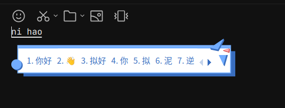
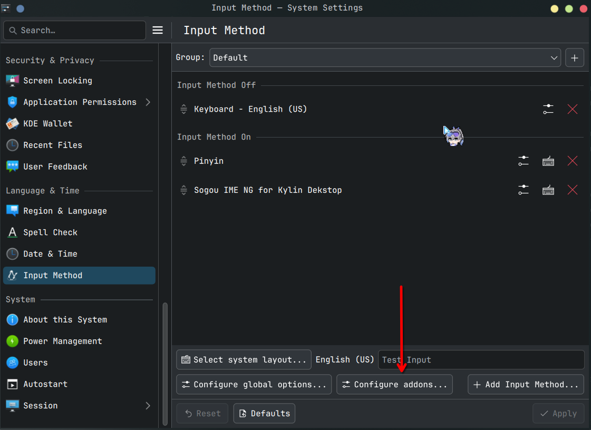
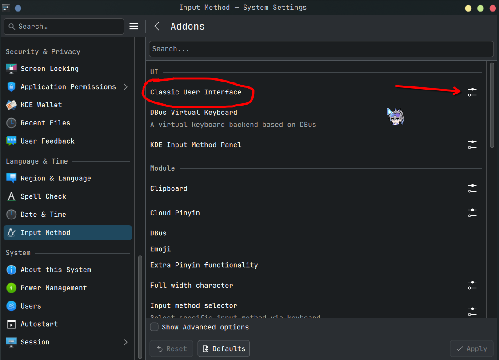
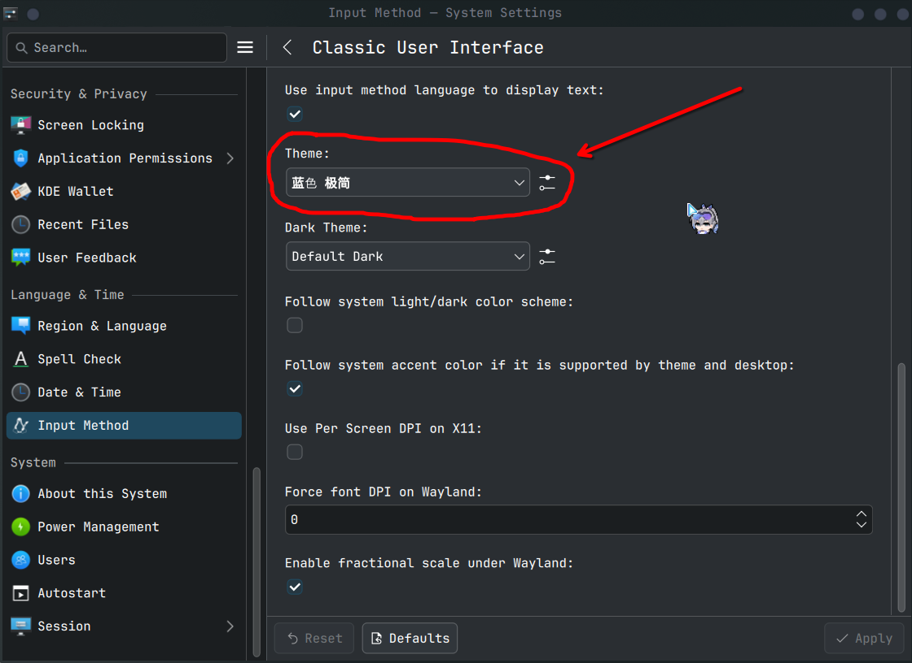

> ⚠️ 注意：
> 
> 本文中的操作均在 **Archlinux** 下进行，其他 Linux 发行版不一定适用喵。

## 1. 安装 Fcitx5
---
在 Archlinux 下使用 `pacman` 安装 `Fcitx5`：

```bash
pacman -S fcitx5-im fcitx5-chinese-addons fcitx5-pinyin-zhwiki
```

> 也可以适用 `aur`，指令如下：
>
> ```bash
> paru -S fcitx5-im fcitx5-chinese-addons fcitx5-pinyin-zhwiki
> ```

## 2. 配置 Fcitx5
配置环境变量，编辑 `~/.pam_environment`：

```bash
GTK_IM_MODULE DEFAULT=fcitx
QT_IM_MODULE  DEFAULT=fcitx
XMODIFIERS    DEFAULT=\@im=fcitx
SDL_IM_MODULE DEFAULT=fcitx
```

保存后，重启。正常情况下 Fcitx5 已经可以正常启动了。

## 3. 个性化 Fcitx5
---
事实上，Fcitx5 是支持输入法皮肤的，就像这样：



皮肤的来源是**搜狗输入法**，从[搜狗输入法官网](https://pinyin.sogou.com/skins/)下载到的皮肤文件格式为 `.ssf`，该文件格式无法直接被 Fcitx5 使用，需要拆解成图片后做成文件夹丢到 `/home/coldrain/.local/share/fcitx5/themes` 里。

具体如何转换呢？这里推荐一个小工具，叫 [ssfconv](https://github.com/fkxxyz/ssfconv)，可以把 `.ssf` 拆解为 Fcitx5 的皮肤文件。

将工具下载后，将 `.ssf` 皮肤文件放到该项目文件夹下，激活 Python 虚拟环境（`conda` 或 `virtual environment`），使用以下命令转换皮肤：

```bash
python ssfconv -t fcitx5 你下载的皮肤.ssf 你下载的皮肤（换个名字生成文件夹）
```

> ⚠️ **注意**：
>
> 运行上述指令后，正常情况下会出现 `ModuleNotFoundError: No module named 'Crypto'` 这样的报错，说明你的环境里缺少这个包，使用 `pip` 安装一下即可：
>
> ```bash
> # 比如这里我缺少 Crypto 包
> pip install crypto
> ```
>
> ⚠️ **特别注意**：
>
> `Crypto` 包安装之后，如果依然出现 `ModuleNotFoundError: No module named 'Crypto'` 报错，**不要慌张**，大概率是文件命名出现了问题（可能是 `Crypto` 的作者没有处理好相关操作吧 💦），`conda` 环境的解决思路如下：
> - 首先，打开 `conda` 环境的包文件夹，默认是在 `/home/coldrain/.conda/envs/ENVIRENMENT_NAME/lib/python3.X/site-packages` 下（`ENVIRONMENT_NAME` 为你的环境名称，`python3.X` 为环境中对应版本的 python 文件夹）。
> - 然后，将 `crypto` 和 `crypto-1.4.1.dist-info` 两个文件的首字母改成大写，即 `Crypto` 和 `Crypto-1.4.1.dist-info`。
> - 检查目录下面有没有 `pycroptodome` 文件夹，如果没有的话，运行下面的命令安装：
>
> ```bash
> pip install pycroptodome
> ```

执行命令后，会在当前目录下生成皮肤文件夹，文件树如下：

```tree
tree
.
├── 皮肤名称
│   ├── 16819877314275_former.jpg
│   ├── a1.png
│   ├── a2.png
│   ├── a3.png
│   ├── arrow.png
│   ├── ban1.png
│   ├── ban2.png
│   ├── ban3.png
│   ├── bar.png
│   ├── cn1.png
│   ├── cn2.png
│   ├── cn3.png
│   ├── cn_biaodian1.png
│   ├── cn_biaodian2.png
│   ├── cn_biaodian3.png
│   ├── comp_631184.png
│   ├── en1.png
│   ├── en2.png
│   ├── en3.png
│   ├── en_biaodian1.png
│   ├── en_biaodian2.png
│   ├── en_biaodian3.png
│   ├── highlight.png
│   ├── menu_highlight.png
│   ├── next.png
│   ├── oh2_custom01.png
│   ├── oh_custom01.png
│   ├── prev.png
│   ├── quan1.png
│   ├── quan2.png
│   ├── quan3.png
│   ├── radio.png
│   ├── skin1_1.png
│   ├── skin1_2.png
│   ├── skin1.png
│   ├── skin2_1.png
│   ├── skin2_2.png
│   ├── skin2.png
│   ├── skin.ini
│   ├── skinmanager1.png
│   ├── skinmanager2.png
│   ├── skinmanager3.png
│   └── theme.conf
├── 皮肤名称.ssf
├── LICENSE
├── README.md
└── ssfconv

2 directories, 47 files
```

接下来，将你转换好后生成的文件夹复制到 `/home/coldrain/.local/share/fcitx5/themes/` 下即可。

> 如果 `/home/coldrain/.local/share/fcitx5/` 下不存在 `themes` 文件夹，直接创建一个即可。

接下来在设置界面设置皮肤即可，如下所示：







接下来试一下你的输入法，应该可以变成你设置的皮肤了！