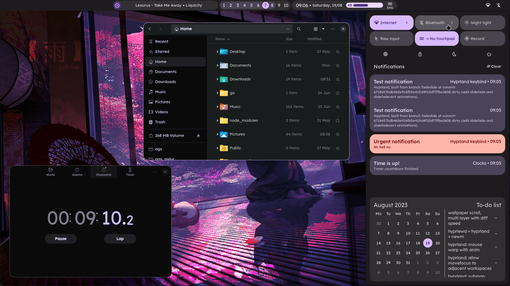
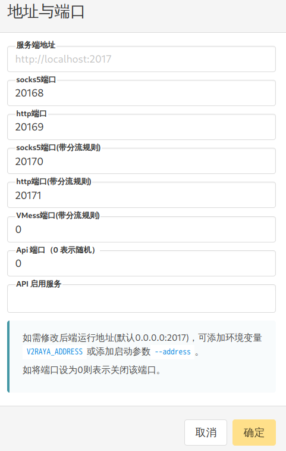

> Coldrain 在暑假期间心血来潮，突然想要给自己的 Archlinux 配一个 Hyprland 桌面，然而过程并非一帆风顺，遂作此篇。

## 1. Hyprland 的安装（手动）
参考 [Hyprland 官网](https://wiki.hypr.land/Getting-Started/Installation/)

> - 这一部分采用**手动**构建的方法，因为官方的 WARNING 让小生担心使用包管理器会出岔子 💦
> 
> - 此外，为方便起见，下文安装部分均采用 `aur` 安装

安装依赖包，确保万无一失：

```bash
paru -S ninja gcc cmake meson libxcb xcb-proto xcb-util xcb-util-keysyms libxfixes libx11 libxcomposite libxrender libxcursor pixman wayland-protocols cairo pango libxkbcommon xcb-util-wm xorg-xwayland libinput libliftoff libdisplay-info cpio tomlplusplus hyprlang-git hyprcursor-git hyprwayland-scanner-git xcb-util-errors hyprutils-git glaze hyprgraphics-git aquamarine-git re2 hyprland-qtutils
```

接下来，采用 `CMake` 构建 `Hyprland`：

```bash
# 随便找一个地方就可以了
git clone --recursive https://github.com/hyprwm/Hyprland
cd Hyprland
make all && sudo make install
```

接下来：

```bash
meson subprojects update --reset
meson setup build
ninja -C build
ninja -C build install --tags runtime,man
```

## 2. 安装必要软件
该部分参考文档：https://wiki.hypr.land/Useful-Utilities/Must-have/
### 2.1 kitty

`kitty` 是 `Hyprland` 的默认终端模拟器，直接 `paru` 安装：

```bash
paru -S kitty
```

此外，`kitty` 的终端界面配置挺有说法的，小生非常推荐，具体可以参考 [kitty 官方文档](https://sw.kovidgoyal.net/kitty/)。

### 2.2 通知程序
如果你的系统上没有安装通知程序的话，这里刚好一并安装了（

```bash
paru -S dunst mako fnott swaync
```

### 2.3 pipewire（用于屏幕共享）
`pipewire` 虽然不是必需的，但是没有这个玩意就无法屏幕共享。

```bash
paru -S pipewire wireplumber
```

### 2.4 Qt Wayland 支持
```bash
paru -S qt5-wayland qt6-wayland
```

## 3. 安装第三方 Hyprland 主题
这里小生采用的是 [end-4 主题](https://github.com/end-4/dots-hyprland)，效果图如下：



话不多说，接下来直接开始安装，这里小生依然采用手动构建的方案（**安装前请先开启代理**）：

```bash
# 随便找一个路径
git clone https://github.com/end-4/dots-hyprland
cd dots-hyprland
./install.sh
```

接下来就是官方的安装程序了，按照程序提示安装即可（**时间较长**且需要全程有操作，请留出足够的空闲时间安装）。

> Coldrain 在执行 `install.sh` 的过程中，`html2markdown` 这个包始终安装失败。
> 
> 如果你在安装的时候也遇到了这个问题，此时请退出安装程序，安装 `html2markdown-bin` 这个包：
>
> ```bash
> paru -S html2markdown-bin
> ```

安装完成后，就可以启动 `Hyprland` 了：

- 在登陆界面切换至 `Hyprland` 即可


## 4. 配置代理（采用 V2raya 和 Proxychains）
在 `Hyprland` 中小生使用 `V2raya` 来作为代理软件，`Xray` 作为内核，首先执行下面指令安装：

```bash
sudo pacman -S v2raya xray

sudo systemctl enable --now v2raya  # 启动并配置开机自启动
```

接下来要设置 `V2raya` 调用 `Xray` 内核（默认配置是调用 `V2ray` 内核，我们不使用 `V2ray` 也就没有安装），可参考[官方文档](https://v2raya.org/docs/manual/variable-argument/#systemd-%E7%AE%A1%E7%90%86%E7%9A%84-v2raya)，下面提供两种方法（**只需要按一种设置即可，推荐第一种**）：

### 4.1 编辑修改 `/etc/default/v2raya` 配置文件
首先打开 `/etc/default/v2raya` 文件

```bash
sudo vim /etc/default/v2raya
```

然后找到 `V2RAYA_V2RAY_BIN` 和 `V2RAYA_V2RAY_ASSETSDIR` 两个环境变量，将其前面的 `#` 去掉，并将其值按如下修改

```bash
V2RAYA_V2RAY_BIN=/usr/bin/xray

V2RAYA_V2RAY_ASSETSDIR=/usr/share/xray
```

其中 `/usr/bin/xray` 指的是 `xray` 可执行文件，而 `/usr/share/xray` 指的是 `xray` 数据文件目录（包含了 `geosite.dat` 和 `geoip.dat` 文件）

然后重启 `v2raya` 服务即可

```bash
sudo systemctl restart v2raya
```

### 4.2 编辑修改 `systemd` 管理的配置文件
新建一个文件夹 `/etc/systemd/system/v2raya.service.d`，然后进入文件夹新建一个文件 `xray.conf`，类似的，写入以下内容：

```bash
[Service]
Environment="V2RAYA_V2RAY_BIN=/usr/bin/xray"
Environment="V2RAYA_V2RAY_ASSETSDIR=/usr/share/xray"
```

然后执行下面指令重新加载 `V2rayA` 服务即可：

```bash
sudo systemctl daemon-reload && sudo systemctl restart v2raya
```

然后我们直接在终端执行 `firefox` 进入火狐浏览器，然后访问 `http://127.0.0.1:2017` 进入 `V2raya` 配置界面，导入自己的配置规则

点击右上角的设置，关闭 `透明代理/系统代理` 选项，然后将 `规则端口的分流模式` 选为 `RoutingA`，随后点击右边的 `配置` 选项，写入以下内容（用默认配置不改也行，也可以根据自己的需要更改）：

```bash
default: proxy
# write your own rules below

domain(geosite:cn)->direct
ip(geoip:private)->direct
ip(geoip:cn)->direct
```

然后点击保存，注意此时这些规则并不会生肖，因为 `V2raya` 为 `socks` 协议和 `http` 协议设置了**带分流规则的端口**（该端口进来的流量会按照分流规则分流）和**不带分流规则的端口**（该端口进来的流量并不会按照规则分流），而且默认只设置了 `http` 的分流端口，因此需要我们下面手动设置带分流规则的端口。

我们可以点开设置界面左下角的`地址与端口`选项，然后填写 `带分流规则的 socks 端口` 并保存，如下所示：



### 4.3 编辑 `~/.config/hypr/hyprland.conf` 配置文件
在 `~/.config/hypr/hyprland.conf` 配置文件中写入如下内容以配置代理端口：

```conf
env = ALL_PROXY=socks5://127.0.0.1:20168
env = http_proxy=socks5://127.0.0.1:20168
env = https_proxy=socks5://127.0.0.1:20168
```

### 4.4 安装 Proxychains

使用 `Proxychains` 从终端启动应用程序的话，可以实现指定端口开启，从而让应用程序走代理。

执行下面的命令：

```bash
paru -S proxychains
```

安装完成后，编辑 `/etc/proxychains.conf`，找到最下方的 `[ProxyList]`，添加上一步中 `v2raya` 设置的代理，例如：

```conf
[ProxyList]
socks5 127.0.0.1 20168
```

然后就可以用 `proxychains` 让有些需要访问网络的程序走代理了喵，试试用下面这个指令打开 `Firefox`，看看能否正常使用代理（请确保 `v2raya` 正常运行）：

```bash
proxychains firefox
```

> 小生最初尝试的其实是 `google-chrome-stable`，但是实际上发现 `google-chrome-stable` 的沙盒机制会导致 `proxychains` 无法正常启动 `google-chrome-stable`，需要执行以下命令：
>
> ```bash
> proxychains google-chrome-stable --no-sandbox --disable-zygote
> ```
>
> 但是小生如此尝试后，`google-chrome-stable` 依然无法正常使用代理，目前暂时不清楚具体原因，小生决定先用 `Firefox` 吧（


## 5. 终端配置（kitty）

`hyprland` 的默认终端模拟器使用的是 [kitty](https://sw.kovidgoyal.net/kitty/)，一款配置简单、界面美观的终端模拟器，详细教程参考官网。

`kitty` 的配置文件默认为 `~/.config/kitty/kitty.conf`，关于 `kitty` 的配置都可以写在这个文件里面。

> #### ❓ `hyprland` 下 `kitty` 可能遇到的问题及解决方案
> 
> 如果你编写完你的 `kitty.conf` 文件后，发现你的终端模拟器界面没有发生任何改变的话，可以参考一下本段内容。
>
> 打开你的 `~/.config/hypr/hyprland/env.conf` 文件（或者你自己的 `hyprland` 配置文件），检查其中是否包含如下内容：
>
> ```bash
> env = TERMINAL,kitty -1
> ```
>
> 如果有这一行内容，那么说明你的 `hyprland` 在启动终端时调用的是 `kitty -1` 而不是单纯的 `kitty`，也就是说：如果有一个 `kitty` 实例已经在跑，`hyprland` 在后续启动 `kitty` 的时候，只是在里面开一个新窗口，而不是重新开一个 `kitty` 实例。
>
> #### 解决方案：
> - 关闭所有 `kitty` 窗口，然后重新启动即可。
>
> ```bash
> pkill kitty
> kitty
> ```
> - 或者直接更改 `env = TERMINAL,kitty -1` 为 `env = TERMINAL,kitty`，这样的话每次打开终端的逻辑就变成了：创建一个新的 `kitty` 实例。


## 6. 启动失败问题及解决方案
目前 Coldrain 已经遇到过一次 **从 SDDM 登陆界面启动 Hyprland 后又回到了 SDDM 登陆界面**的赛博鬼打墙（

Coldrain 切换至 tty3 中，试图查找 Hyprland 的运行日志来调查问题的根本原因，但是发现 Hyprland 根本没有生成运行日志，也就是说，Hyprland 还没来得及写日志，就已经崩溃了。

于是，Coldrain 尝试从 tty 中启动 Hyprland，看看是怎么崩溃的：

```bash
Hyprland
```

结果根据报错信息发现是 abseil 版本过新，导致 hyprland 无法找到原本配置文件的位置（人话就是：滚包把 hyprland 滚炸了💦）

Coldrain 接着前往 Hyprland 官方文档的 Q&A 中寻找解决方案，发现官方已经注意到这个问题。那么解决方案就是：把你系统中所有包含 `hypr*` 的包及依赖这些包的包全部卸载掉，然后重新用 `cmake` 编译 Hyprland，Coldrain 亲测有效（虽然有点麻烦就是了）。

---

## 参考资料
[1] https://wiki.hypr.land/Getting-Started/Installation/
[2] https://end-4.github.io/dots-hyprland-wiki/en/ii-qs/01setup/
[3] https://blog.manjusaka.de/p/0-0-0-52/#%E5%AE%89%E8%A3%85%E4%BB%A3%E7%90%86%E5%B7%A5%E5%85%B7v2raya