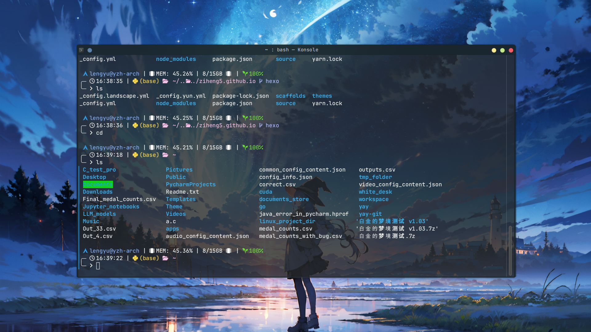

> oh-my-posh 官方网址：https://ohmyposh.dev/
>
> 此外，本文不涉及 `Windows` 下 oh-my-posh 的配置，具体操作见[官方文档](https://ohmyposh.dev/docs/installation/windows)

## 1. 安装 oh-my-posh
### Ubuntu
```bash
curl -s https://ohmyposh.dev/install.sh | bash -s
```

> 如果 Ubuntu 上还没有安装 curl 的话，先安装 curl：
> ```bash
> sudo apt install curl
> ```

另外，`Ubuntu` 系统下用 `curl` 安装 oh-my-posh，默认安装位置在 `/home/USER/.local/oh-my-posh`

### Archlinux
```bash
paru -S oh-my-posh
```
`Archlinux` 系统下用 `pacman` 安装 oh-my-posh 的话，默认安装位置应该是在 `/usr/share/oh-my-posh`

## 2. 配置 bashrc
在安装完成后，打开安装位置处 `oh-my-posh` 文件夹下的 `themes` 文件夹，其中包含了官方的示例主题（可以在此基础上自由配置）。

我们从中找到 `catppuccin_mocha.omp.json` 文件，即 `catppuccin_mocha` 主题的配置文件，复制文件路径，然后打开终端，输入

```bash
vim ~/.bashrc
```

进入 `bashrc` 开始为终端配置 `oh-my-posh`，在其中添加下面这行代码：

```bash
# 此处的 location 为 oh-my-posh 的安装位置
eval "$(oh-my-posh init bash --config /location/catppuccin_mocha.omp.json)"
```

添加完成后，保存退出，重启终端，就可以看到 oh-my-posh 主题美化后的终端界面了

## 3. 自定义主题
在第 2 步中，我们使用的是官方提供的样例主题，实际上 oh-my-posh 的主题文件是可以自由配置的。

配置文件中，主要修改的控件有 [blocks](https://ohmyposh.dev/docs/configuration/block)、[segments](https://ohmyposh.dev/docs/configuration/segment)，具体用法过多，请移步官方文档。

比如下面这个主题配置，是小生自己编辑出来的，以供参考

```json
{
  "$schema": "https://raw.githubusercontent.com/JanDeDobbeleer/oh-my-posh/main/themes/schema.json",
  "palette": {
        "os": "#ACB0BE",
        "closer": "p:os",
        "pink": "#F5C2E7",
        "lavender": "#B4BEFE",
        "blue":  "#89B4FA"
  },
  "blocks": [
    {
      "alignment": "left",
      "newline": true,
      "segments": [
        
        {
          "foreground": "#3498DB",
          "style": "plain",
          "template": " {{.Icon}} ",
          "type": "os"
        },
        {
          "foreground": "p:blue",
          "style": "plain",
          "template": "{{ .UserName }}@{{ .HostName }} ",
          "type": "session"
        },
        {
          "foreground": "#FFFFFF",
          "style": "plain",
          "template": "| \ue266 MEM: {{ round .PhysicalPercentUsed .Precision }}% | {{ (div ((sub .PhysicalTotalMemory .PhysicalAvailableMemory)|float64) 1073741824.0) }}/{{ (div .PhysicalTotalMemory 1073741824.0) }}GB \ue266  |",
          "type": "sysinfo"
        },
        {
          "type": "battery",
          "style": "plain",
          "foreground": "#6CE035",
          "template": " {{ if not .Error }}{{ .Icon }}{{ .Percentage }}{{ end }} ",
          "properties": {
            "discharging_icon": "\ue304 ",
            "charging_icon": "\uf5f8 ",
            "charged_icon": " "
          }
        }


      ],
      "type": "prompt"
    },
    
    {
      "alignment": "left",
      "newline": true,
      "segments": [
        {
          "style": "plain",
          "template": "\u256d\u2500",
          "type": "text"
        },
        {
          "properties": {
            "time_format": "15:04:05"
          },
          "style": "plain",
          "template": " \uf017 {{ .CurrentDate | date .Format }} |",
          "type": "time"
        },
        {
          "foreground": "#FFDE57",
          "properties": {
              "display_mode": "environment",
              "fetch_virtual_env": true,
              "home_enabled": true
          },
          "style": "plain",
          "template": " \ue235 {{ if .Venv }}({{ .Venv }}){{ end }}",
          "type": "python"
        },
        {
          "style": "plain",
          "template": " \uf292 ",
          "type": "root"
        },
        {
          "foreground": "p:pink",
          "properties": {
            "folder_icon": "..\ue5fe..",
            "home_icon": " ~",
            "style": "agnoster_short"
          },
          "style": "plain",
          "template": " \uf07c {{ .Path }} ",
          "type": "path"
        },
        {
          "foreground": "p:lavender",
          "properties": {
            "branch_icon": "\ue725 ",
            "cherry_pick_icon": "\ue29b ",
            "commit_icon": "\uf417 ",
            "fetch_status": false,
            "fetch_upstream_icon": false,
            "merge_icon": "\ue727 ",
            "no_commits_icon": "\uf0c3 ",
            "rebase_icon": "\ue728 ",
            "revert_icon": "\uf0e2 ",
            "tag_icon": "\uf412 "
          },
          "template": "{{ .HEAD }} ",
          "style": "plain",
          "type": "git"
        }
      ],
      "type": "prompt"
    },

    {
      "alignment": "left",
      "newline": true,
      "segments": [
        {
          "properties": {
            "always_enabled": true
          },
          "style": "plain",
          "template": "\u2570\u2500 ",
          "type": "status"
        },
        {
          "style": "plain",
          "foreground": "#FFFFFF",
          "template": "\uf105",
          "type": "text"
        }
      ],
      "type": "prompt"
    }
  ],
  "final_space": true,
  "version": 3
}

```