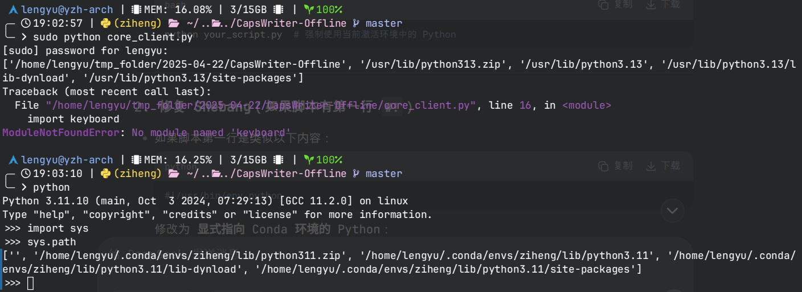
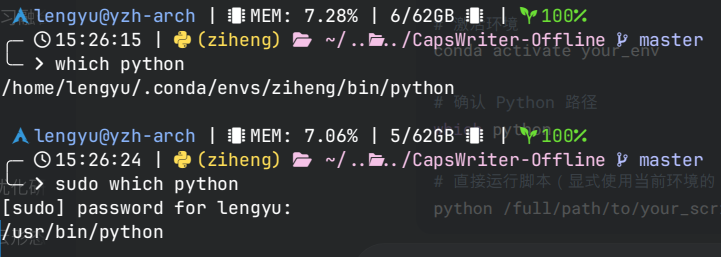

> coldrain 的学弟最近推荐了一个很棒的[语音识别项目](https://github.com/HaujetZhao/CapsWriter-Offline/releases)，coldrain 想要在 Linux 上运行这个项目。
>
> 阅读完 README.md 文件后，coldrain 得知该项目需要同时运行两个 `.py` 文件，并且其中一个需要使用 `sudo` 运行。coldrain 在 `conda` 虚拟环境中安装完所有的依赖包后，尝试用 `sudo` 运行 `.py` 文件时，引发了 `ModuleNotFoundError`...

## 🔎 查找原因
coldrain 上网查阅相关资料后，开始怀疑文件是否正确在虚拟环境中运行，于是想办法进行排查：

- 首先，coldrain 在需要用 `sudo` 运行的 `.py` 文件开头加入了以下内容后并运行，以输出 Python 解释器的位置：

    ```python
    import sys
    print(sys.path)
    ```

- 接着，coldrain 在当前虚拟环境中直接激活 Python 解释器，并查看当前 Python 解释器的路径：
    ```bash
    # 在 conda 虚拟环境中运行下面这行命令
    python
    ```

    ```python
    >>> import sys
    >>> sys.path
    ```

结果如下图所示：



果不其然，结果显示两种运行方式下使用的 Python 解释器信息不同！

接下来，coldrain 进一步确认 Python 解释器路径

```bash
# 在 conda 虚拟环境中运行下面的命令
which python

sudo which python
```

输出如下图所示：



## 问题原因
Linux 系统下，由于管理员身份和用户身份下环境变量有所不同，在 `conda` 虚拟环境中直接使用 Python 解释器和用 `sudo` 使用 Python 解释器，两者路径并不相同。

## 解决方案
在利用 `sudo` 运行 `.py` 文件的同时，指定调用虚拟环境中的 Python 解释器，用法如下：

```bash
sudo /home/lengyu/.conda/envs/ziheng/bin/python xxx.py
```
