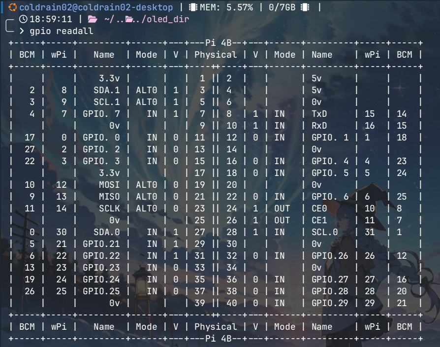
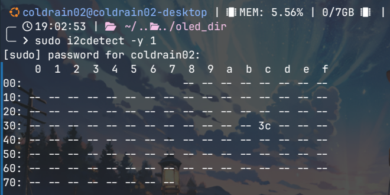
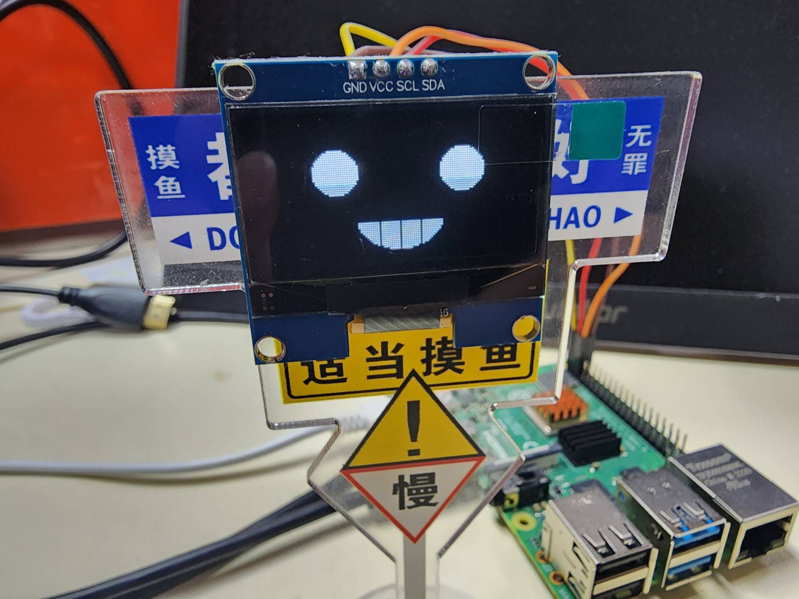
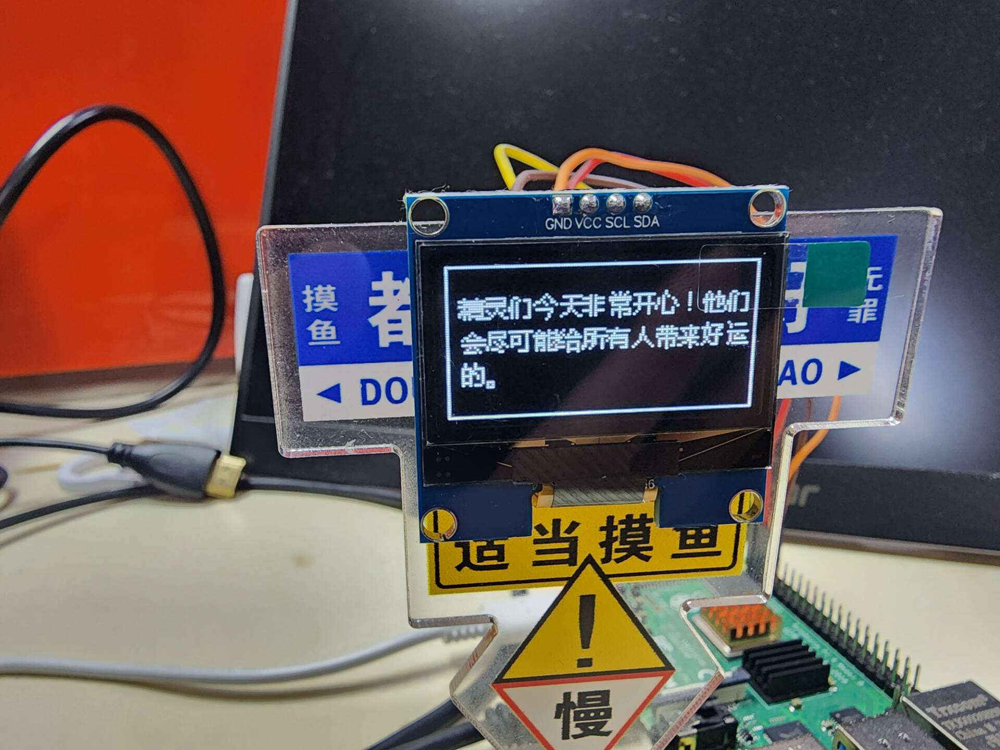

> 本文使用 `luma.oled` 库来对 I2C 接口 oled 显示器进行编辑
>
> `luma.oled` 支持 **SSD1306 / SSD1309 / SSD1322 / SSD1325 / SSD1327 / SSD1331 / SSD1351 / SSD1362 / SH1106 / WS0010**
>
> 安装 `luma.oled` 只需要在 python 虚拟环境中使用 pip 安装即可：
>
> ```bash
> pip install luma.oled
> ```
>
> **PS:** 小生记得这里需要一些基本配置，否则 build 过程会引发报错，按照报错提示来配置即可

## 1. 硬件连接
首先贴出树莓派的引脚图：



> 可以直接执行以下命令查看 gpio 引脚情况：
>
> ```bash
> gpio readall
> ```

在图中找到 `3.3v`、`SDA.1`、`SCL.1`、`GND` 这四个引脚，分别对应 **1、3、5、6** 号引脚

接着在 I2C 接口的 oled 显示器上找到四个引脚：
- **GND**：电源地线
- **VCC**：电源正极，大部分 oled 模块 3.3v 即可驱动
- **SCL**：I2C 时钟线
- **SDA**：I2C 数据线

接着用双母头杜邦线连接四对引脚：`3.3v-VCC`、`GND-GND`、`SDA.1-SDA`、`SCL.1-SCL`

> ⚠️ 注意电源正负极不要接反了，容易把板子烧掉。

根据上文的步骤连接好 oled 模块，查找 oled 的 I2C 地址。每一个 oled 模块的 I2C 地址不一定都相同，需要先查找获取地址，同时也检查以下 oled 模块是否连接正常

输入以下指令：

```bash
sudo i2cdetect -y 1
```

输出以下界面：



上图中，3c 代表的就是 oled 模块的 I2C 地址。

---

## 2. 代码调试

> 这部分要注意自己的硬件信息，不要盲目 copy

将下面的这段代码复制到 .py 文件中，尝试运行调试：

```Python
from luma.core.interface.serial import i2c, spi
from luma.core.render import canvas
from luma.oled.device import ssd1306, ssd1325, ssd1331, sh1106
from time import sleep
import random

__version__ = 1.0
# 初始化端口
serial = i2c(port=1, address=0x3c)
# 初始化设备，这里改 ssd1306, ssd1325, ssd1331, sh1106
device = sh1106(serial)

with canvas(device) as draw:
    draw.ellipse((44, 32, 84, 60), outline="white", fill="white")
    draw.rectangle((44, 32, 84, 46), outline="black", fill="black")
    draw.line((54, 46, 54, 60), fill="black")
    draw.line((64, 46, 64, 60), fill="black")
    draw.line((74, 46, 64, 60), fill="black")
    draw.ellipse((24, 12, 44, 32), outline="white", fill="white")
    draw.ellipse((84, 12, 104, 32), outline="white", fill="white")

sleep(10)   # oled 显示器显示 10 秒
```

如果不出意外的话，oled 显示器上会出现下面这个笑脸 😁：



下面来具体讲一讲上面这段代码：

```Python
# 初始化设备，这里改 ssd1306, ssd1325, ssd1331, sh1106
device = sh1106(serial)
```

这段代码主要作用是初始化设备
- 如果 oled 的驱动芯片不是 sh1106，需要更换对应的函数名
- 如果 oled 尺寸不同，则需要传不同的参数，例如如果是 0.91 寸的 128*64 的 oled 则代码应修改为 `device = ssd1306(serial, width=128, height=64)`

```python
with canvas(device) as draw:
    draw.ellipse((44, 32, 84, 60), outline="white", fill="white")
    draw.rectangle((44, 32, 84, 46), outline="black", fill="black")
```

- `canvas` 英文单词含义为画布，意思是可以在这里输入各种需要显示的内容。
- 这段代码使用了 `with...as...:` 语法，关于 with 的详细用法可以暂且不论，这里可以简单地理解为先执行 `canvas` 函数，然后返回对象赋值给 `draw` 变量，用此语法创建的对象，会在使用结束后自动释放资源，常用于打开某个文件夹，之后自动关闭文件夹。
- `draw.ellipse()` 为画椭圆的函数。
- `draw.rectangle()` 为画矩形的函数，类似的还有画直线、三角形等。

## 3. 显示汉字
代码如下：

```python
from luma.core.interface.serial import i2c, spi
from luma.core.render import canvas
from luma.oled.device import ssd1306, ssd1325, ssd1331, sh1106
from time import sleep
from PIL import ImageFont

# 初始化端口
serial = i2c(port=1, address=0x3c)
# 初始化设备
device = sh1106(serial)
# 调用显示函数
font = ImageFont.truetype('../source/msyh/msyh.ttf')

with canvas(device) as draw:
    draw.rectangle(device.bounding_box, outline="white", fill="black")
    draw.text((5, 10), "精灵们今天非常开心！他们", fill="white", font=font)
    draw.text((5, 24), "会尽可能给所有人带来好运", fill="white", font=font)
    draw.text((5, 38), "的。", fill="white", font=font)

# 显示 5s
sleep(5)
```

显示效果如下：



代码解析：

- `from PIL import ImageFont` 这个是强大的 `PIL` 库中的字体类，显示汉字，默认字体就不行了，所以需要新增字体文件
- `font = ImageFont.truetype("../source/msyh/msyh.ttf")` 这段代码的含义是调用当前目录下的字体文件 `msyh.ttf` 创建一个字体类，`msyh.ttf` 是微软雅黑字体，可以上网自行下载，也可以下载安装其他字体。
- `draw.text((5, 10), "精灵们今天非常开心！他们", fill="white", font=font)` 的含义是在 (5, 10) 位置显示汉字

## 4. 其他 API
具体参考[官方文档](https://luma-oled.readthedocs.io/en/latest/)