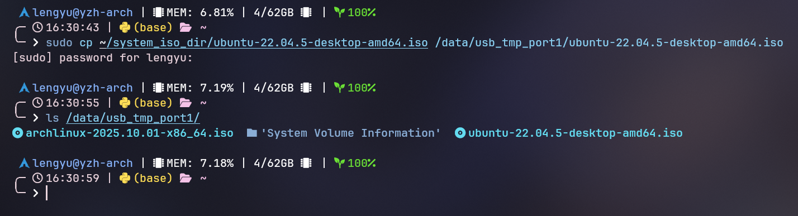
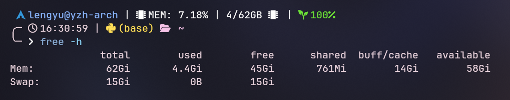

## 0. 案发现场

Coldrain 的同学最近刚刚接触 Linux，想要安装 Ubuntu 操作系统，然而苦于网速太慢而难以下载 4.4 GB 大小的镜像文件，身旁的 Coldrain 见状后，便准备用 U 盘将自己硬盘里的 Ubuntu 镜像拷给同学，结果在将文件传输给 U 盘并插入到同学的电脑上时，U 盘里并没有出现系统镜像文件...

注：
- 使用的操作系统：`Arch Linux`
- U 盘文件系统：`exFAT`
- U 盘挂载点：`/data/usb_tmp_port1/`
- 传输的文件：`ubuntu-22.04.5-desktop-amd64.iso`，大小 4.4 GB

## 1. 问题分析
> 省流：是 Linux 缓存机制的问题，想节约时间可以**直接移步至 1.3 部分**
### 1.1 文件系统
U 盘上常用的文件系统有 `FAT32`、`exFAT`、`NTFS`、`ext4`，而这四种文件系统的特点如下：
- **FAT32**：兼容性极好，各大操作系统均支持，最高支持存储容量为 8TB，然而单个文件最大不能超过 4 GB
- **exFAT**：兼容性较好，支持 Windows、Linux、Mac 等现代操作系统，但不支持较老的操作系统。最高支持存储容量可达 16 EB，单个文件可以大于 4 GB
- **NTFS**：兼任性一般，主要用于 Windows，如果想在 Linux 和 Mac 上使用的话需要自行安装驱动。存储容量与单文件大小理论上均可达到 16 EB
- **ext4**：兼容性差，主要用于 Linux，不支持 Windows 与 Mac

考虑到 U 盘使用的文件系统为 `exFAT`，单个文件大小可以超过 4GB，所以应该不是文件系统的问题

### 1.2 硬件损坏
考虑到硬件问题，Coldrain 尝试在 Windows 上将 U 盘格式化为 `NTFS` 格式，发现 U 盘可以正常通过 Windows 操作系统传入任意文件。

所以 U 盘并没有损坏。

### 1.3 Linux 缓存机制
> 具体来说，操作系统会将数据先写入内存中的缓冲区，然后定期或在某些特定条件下将这些数据写入磁盘，这样可以提高性能。

现代操作系统（包括 Linux）通常会使用 文件系统缓存 来提高文件操作的效率。也就是说，当你写入一个文件时，操作系统并不会立即将文件内容写入磁盘，而是先将它存储在内存中的缓存区域。这是为了提高磁盘写入的速度，因为磁盘操作相对较慢，直接每次写入都会降低性能。

这也意味着，虽然文件已经通过系统接口写入文件系统，但它实际上仍然存储在内存中的缓存区，直到缓存被刷新到磁盘。操作系统会定期或者在某些特定时机（例如卸载设备或调用 sync 命令时）将这些缓存数据写入磁盘。

大多数文件系统（包括 `exFAT`）采用`异步写入`模式，这意味着文件数据在内存缓存区中可以等待一段时间再写入磁盘。这种方法可以减少写入操作的次数，提高性能，特别是在进行大量小文件写入时。然而，这也带来了一个问题：如果在缓存数据被写入磁盘之前，系统发生了故障或设备被强制拔出，那么部分数据就可能丢失。

接下来，Coldrain 复现了这个问题。

首先，执行 `free -h` 查看缓存情况：

从上图中可以看出，此时的 `buff/cache` 一栏显示 `3.4Gi`

接下来，Coldrain 将 U 盘插入电脑 USB 接口，并执行 `sudo mount /dev/sda /data/usb_tmp_port1` 将 U 盘挂载到 `/data/usb_tmp_port1` 目录下，结果如下：

然后，将大小为 `4.4Gi` 的 `ubuntu-22.04.5-desktop-amd64.iso` 文件复制到 U 盘所在的挂载点：

再次查看缓存（好吧其实上面 Coldrain 为了截图，将文件多复制了一次，所以这里缓存多了 `9Gi` 左右）：

这个时候，根据 `ls /data/usb_tmp_port1` 的结果，你也许会认为文件已经复制进去了，那么当你将 U 盘取消挂载、拔出，然后再次插入、挂载后，会发现刚才“复制进去”的 `ubuntu-22.04.5-desktop-amd64.iso` 文件消失不见了！

## 2. 解决方案

对文件执行 `cp` 命令复制到 U 盘之后，先检查文件是否留存在缓存区，比如可以使用 `free -h` 对比操作前后的缓存变化。

若文件暂存在缓存区，使用 `sync` 即可强制将文件写入 U 盘，如下图所示：

